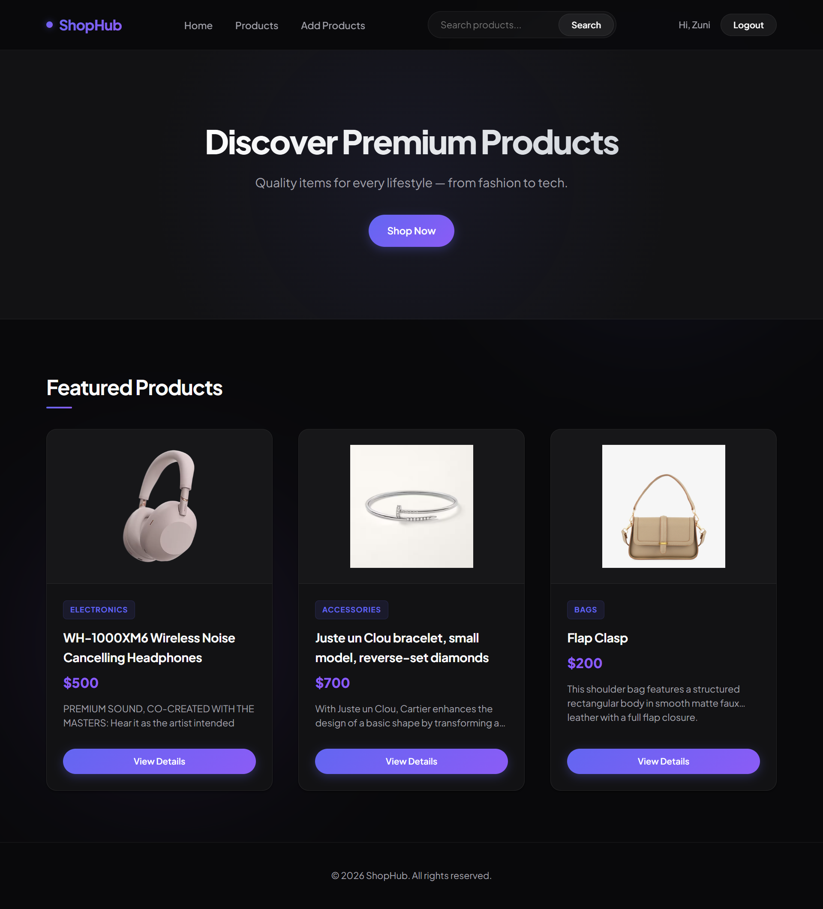
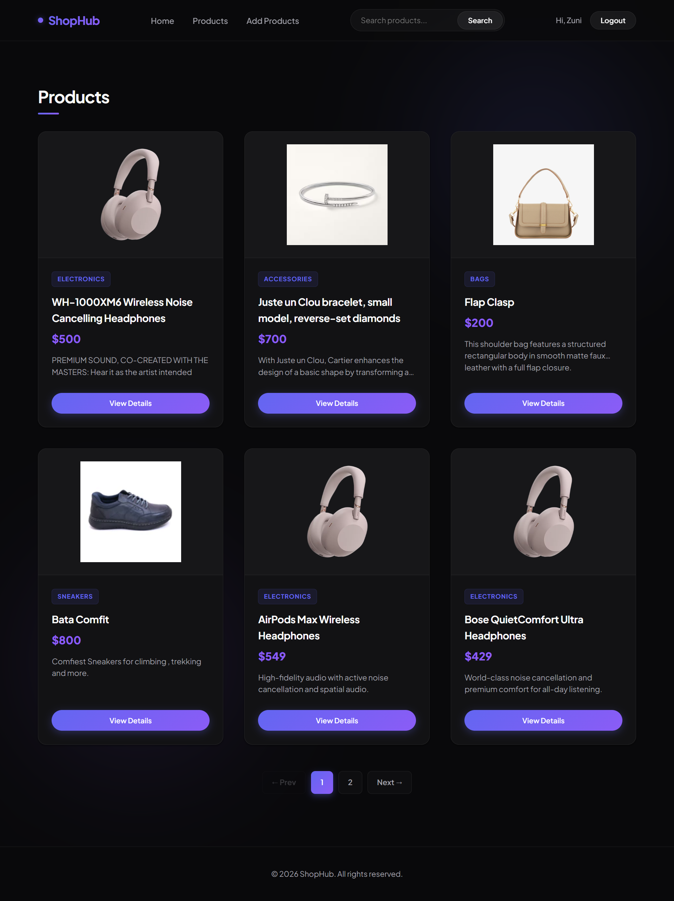
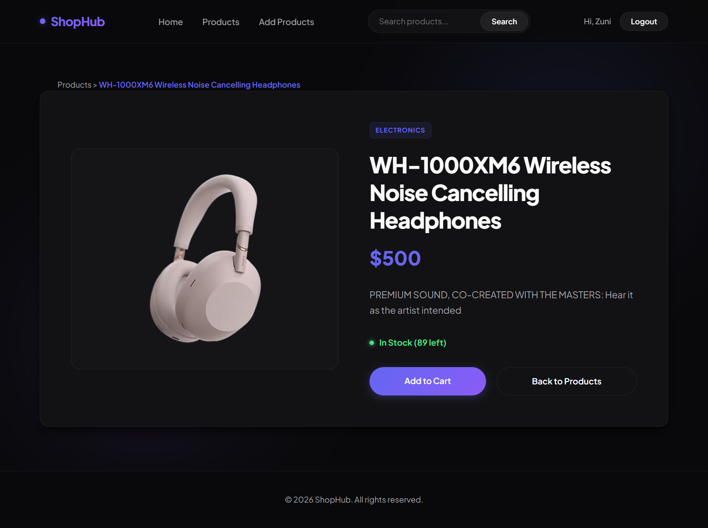
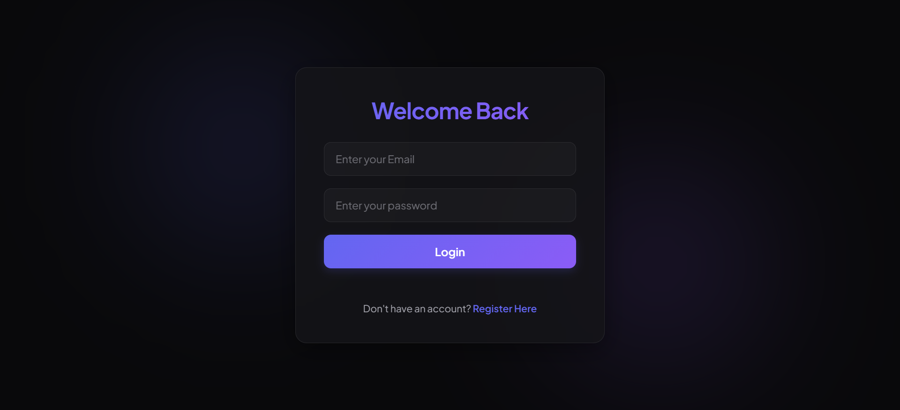
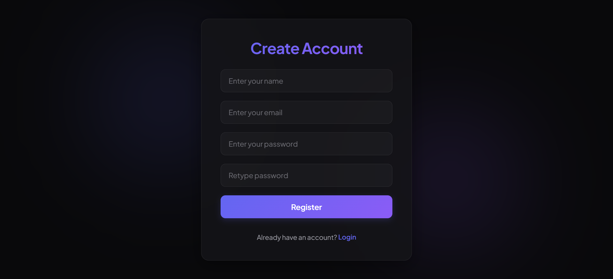
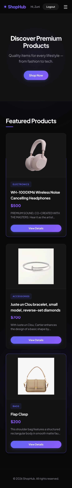

# Ecommerce Backend Design

A full-stack eCommerce web application built as part of the DevelopersHub Backend Development Internship Task. This project integrates a responsive frontend design with a dynamic backend using Node.js, Express.js, MongoDB, EJS templating, authentication, and product management features.

## 🚀 Features

### Week 1 - Project Setup & Static Integration

* Node.js and Express.js server setup
* Organized project structure
* Static routes implementation
* Responsive design for desktop and mobile devices

Pages:

* Home Page
* Product Listing Page
* Product Details Page

Routes:

* `/`
* `/products`
* `/products/:id`

### Week 2 - Database Integration & Dynamic Content

* MongoDB database integration
* Dynamic product rendering using EJS
* Product search functionality
* Featured products section
* Product listing from database
* Product details page with dynamic content

### Week 3 - Backend Features & Final Integration

* JWT Authentication
* User Registration & Login
* Protected Routes
* Product Creation Form
* Product Pagination
* Deployment Ready

## 🛠️ Tech Stack

### Backend

* Node.js
* Express.js

### Database

* MongoDB
* Mongoose

### Frontend

* HTML5
* CSS3
* JavaScript
* EJS

### Authentication

* JSON Web Tokens (JWT)
* bcrypt.js


## ⚙️ Installation

### Clone Repository

```bash
git clone 
cd Week1/Week2/Week3
```

### Install Dependencies

```bash
npm install
```

### Configure Environment Variables


```
PORT=3000
MONGO_URI=your_mongodb_connection_string
JWT_SECRET=your_secret_key
```

### Run Development Server

```bash
npm run dev
```

Application will run on:

```bash
http://localhost:3000
```


## 🔍 Search Functionality

Users can search products by:

* Product Name
* Product Category


## 📱 Responsive Design

The application is optimized for:

* Desktop Screens
* Tablets
* Mobile Devices


## 🚀 Deployment

Deployed on:


### Production Build

```bash
npm start
```

## 📸 Screenshots


* Home Page

* Product Listing Page

* Product Details Page

* Login Page

* Registration Page

* Mobile View


## 👨‍💻 Author

Developed as part of the DevelopersHub Backend Development Internship Task.

## 📜 License

This project is created for internship evaluation purposes.
